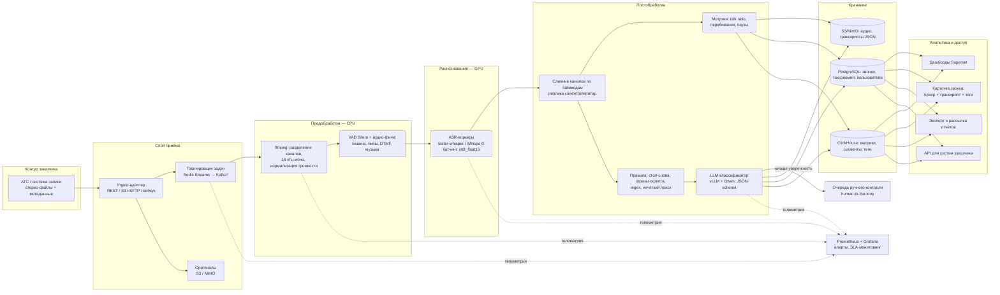

# 02. Архитектура системы

Версия 1.0 от 2026-10-02. Ключевая архитектурная развилка уже решена самим входным форматом:
**стерео с разделением каналов** → спикеры известны физически, нейросетевая диаризация не нужна.
Это дешевле, точнее и быстрее любых решений «диаризация + ASR» для моно-записей.

## 1. Общая схема

\* Redis Streams достаточно до ~50 тыс. задач/час; миграция на Kafka — если объёмы/ретеншн очередей
потребуют (решение зафиксируем после замеров в PoC).

## 2. Поток обработки одного звонка

1. **Обнаружение.** Ingest-адаптер по расписанию (каждые 1–5 мин) опрашивает API заказчика о новых
   записях либо принимает вебхук. Задача (`call_id`, пути, метаданные) — в очередь с приоритетом
   `live`; бэклог-выгрузка кладётся в очередь `backfill` с низким приоритетом.
2. **Предобработка (CPU, ffmpeg).** Разделение каналов → ресемпл 16 кГц моно → нормализация громкости
   (loudnorm) → VAD (Silero): выкидываем тишину, считаем долю речи по каналам, детектируем бипы/DTMF.
   Звонки, где второй канал пуст (типично для автоответчиков), распознаются только по «говорящему» каналу.
3. **ASR (GPU).** Каждый канал независимо, батчами (faster-whisper/CTranslate2, int8_float16).
   Выравнивание до слов — forced alignment (WhisperX / wav2vec2). Пунктуация — из самой Whisper;
   для альтернативных моделей добавляется отдельная модель пунктуации.
4. **Слияние.** Сегменты двух каналов сортируются по `start` → единая хронология реплик с меткой
   спикера. Пересечения сегментов = перебивания; паузы = промежутки без речи.
5. **Классификация.** Каскад: (а) детерминированные правила и аудио-фичи (доля речи по каналам,
   длительность, наличие бипов/музыки, словари «оставьте сообщение», стоп-слова, фразы скрипта через
   нечёткий поиск); (б) LLM со строгой JSON-схемой — финальные метки: тип соединения, результат,
   соблюдение скрипта, конфликтность, теги; (в) низкая уверенность → очередь ручного контроля.
6. **Индексация.** Транскрипт — S3 (JSON + текст), метаданные и вердикты — PostgreSQL, метрики и
   сегменты — ClickHouse. Звонок виден в дашбордах и карточке.
7. **Идемпотентность.** Все стадии пишет результат по ключу `call_id + stage`; повторный запуск
   стадии не создаёт дубликатов; перезапуск возможен с любой стадии (ASR не повторяется при
   смене таксономии — только классификация, FR-41).

## 3. Компоненты и стек

| Слой | Выбор | Альтернатива / комментарий |
|---|---|---|
| Приём | Кастомный ingest-адаптер (Python) | Адаптер изолирует специфику API заказчика; новые источники — новые адаптеры |
| Очередь | Redis Streams + consumer groups | Kafka — при росте; Temporal — если нужны долгие SLA-процессы |
| Предобработка | ffmpeg, Silero VAD | CPU-нода(ы), масштабируется ядрами |
| ASR | faster-whisper (CTranslate2) / WhisperX | Модель выбирается в PoC (см. 03-models): Whisper large-v3-turbo — базовый кандидат |
| Выравнивание слов | WhisperX forced alignment (wav2vec2 ru) | Нужно для перебиваний и перемотки по репликам |
| Классификация | Правила (Python, rapidfuzz) + LLM через vLLM (structured output) | LLM: Qwen3-14B/32B локально; облако — только если разрешит анкета E |
| Объектное хранилище | MinIO (S3-совместимое) | Или S3-совместимое СХД заказчика |
| Метаданные | PostgreSQL | Звонки, статусы, таксономия, RBAC, аудит |
| Аналитика | ClickHouse | Сегменты/теги/метрики, агрегации по 6+ млн звонков |
| BI | Apache Superset | Встраиваемые дашборды, XLSX/PDF-экспорт; Metabase — проще, но менее гибок |
| Карточка звонка | Веб-приложение (FastAPI + фронтенд) | Плеер (wavesurfer.js) с синхронной подсветкой транскрипта |
| Поиск по текстам | ClickHouse full-text (токены) | OpenSearch — если нужен полноценный поисковый движок (фаза 5) |
| Мониторинг | Prometheus + Grafana + Alertmanager | SLA-дашборд: отставание очереди, DLQ, GPU-утилизация, WER-дрейф |

## 4. Режимы работы

- **Live:** новые звонки, приоритетная очередь. SLA ≤ 24 ч с огромным запасом (ожидаемое E2E — минуты).
  При пиковом поступлении воркеры `backfill` временно переключаются на `live`.
- **Backfill:** 450 тыс. часов, низкий приоритет, пакетами; устойчивость к прерываниям и перезапускам
  (чекпоинт по `call_id`). Прогресс и ETA бэклога — отдельный дашборд.
- **Переклассификация:** при изменении таксономии/промптов — повторный прогон стадии классификации
  по транскриптам из S3 без ASR (дёшево; SLA переклассификации всего архива — часы, не дни).

## 5. Безопасность

- Всё внутри контура РФ; TLS на всех передачах; шифрование СХД (опция); оригиналы не размножаются —
  кэш с TTL, основное хранение транскриптов.
- Маскирование номеров телефонов/сумм в транскриптах — флаг обработки (анкета E2); de-маскирование
  только через RBAC.
- Доступ к карточкам/выгрузкам — по ролям; аудит выгрузок; водяные знаки в PDF-отчётах (опция).
- Развертываемо on-prem у заказчика без изменений архитектуры (k8s/docker-compose).

## 6. Развёртывание

- Docker Compose для PoC; Kubernetes (или Nomad) для прода.
- GPU-ноды: ASR-воркеры по количеству карт (по 1 процессу на GPU, батчинг внутри), LLM — vLLM
  с отдельными картами.
- CPU-ноды: ingest, предобработка, слияние, правила, индексация.
- СУБД и S3 — на CPU-нодах/СХД с бэкапами; стенд 1:1 воспроизводится IaC (ansible/terraform).

## 7. Риски и как они закрыты

| # | Риск | Вероятн. | Влияние | Митигация |
|---|---|---|---|---|
| R1 | Телефонное аудио (8 кГц, шум, сленг) даёт WER заметно выше публичных бенчмарков | высокая | среднее | **PoC на реальных данных до закупки**; сравнение 3–4 моделей; выбор по фактам; затравочные словари (имена, продукты) в постобработке |
| R2 | Лицензия GigaAM (SOTA для ru) некоммерческая | высокая | низкое | Базовый план — Whisper (MIT); GigaAM — только при договоре со Сбером (см. 03) |
| R3 | API заказчика: лимиты/нестабильность на выгрузке бэклога | средняя | среднее | Ранний замер скорости выгрузки; физическая отгрузка дисков (анкета A4) |
| R4 | Классификация «спец-ответов» не формализована бизнесом | высокая | среднее | Воркшоп по таксономии в фазе PoC; очередь ручного контроля как страховка; правила правятся без релиза |
| R5 | Объём LLM-классификации на бэклоге (до ~70 тыс. звонков/сут) | средняя | низкое | Каскад: правила отсекают очевидное; локальная LLM на vLLM — копейки/GPU-час; при нехватке — вторая карта |
| R6 | ПДн/152-ФЗ: ограничения на размещение | средняя | высокое | Анкета E до подписания; вариант полного on-prem в контуре заказчика; маскирование |
| R7 | Рост объёма новых звонков (×2–3 за год) | средняя | низкое | Горизонтальное масштабирование: +GPU-карта = +~800 ч/сутки пропускной способности |
| R8 | Дрейф качества (новые кампании, смена скриптов) | средняя | среднее | Регресс-набор размеченных звонков; мониторинг WER-выборки ежемесячно; дообучение словарей |
